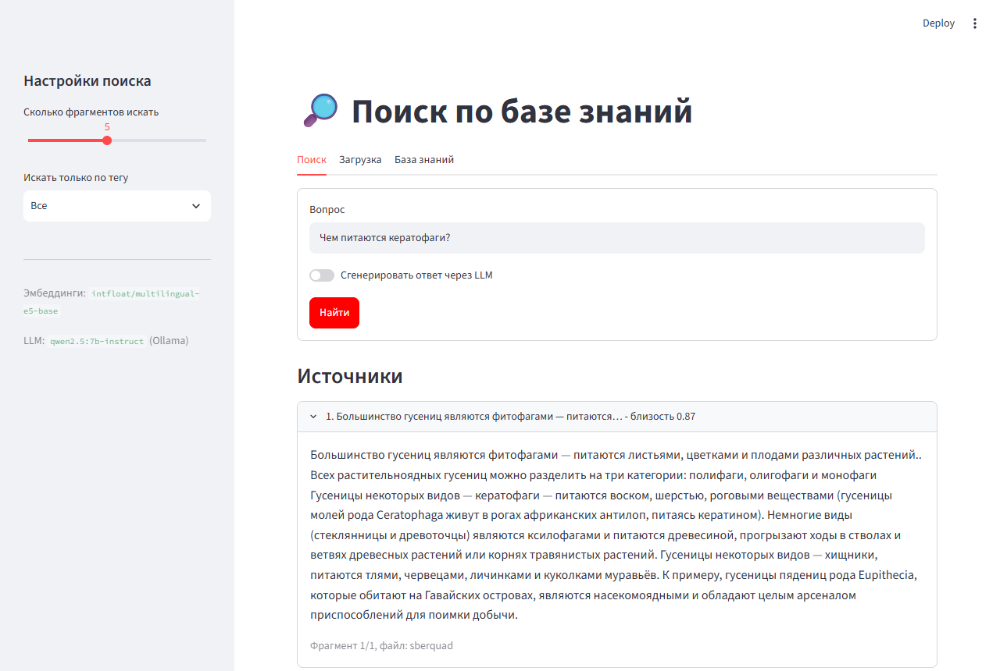

# local-rag-search

Поиск по базе инструкций с помощью RAG. Загружаешь документы (.docx, .md, .txt), задаёшь вопрос, программа находит подходящие куски текста, и LLM составляет по ним ответ.

Всё работает локально: эмбеддинги multilingual-e5, база ChromaDB, LLM через Ollama.



## Что умеет

- поиск по смыслу, а не только по совпадению слов
- картинки из документов показываются в ответе
- несколько инструкций в одном файле через разделитель ---
- теги, можно пометить инструкцию как неактуальную
- интерфейс на Streamlit, REST API и консольные команды
- если Ollama не запущена, показывает просто найденные куски

## Запуск

На Windows клонируйте проект в папку без кириллицы в пути (например `D:\projects`), иначе ChromaDB может не открыть базу.

```bash
git clone https://github.com/arlequiiin/local-rag-search.git
cd local-rag-search
python -m venv .venv
.venv\Scripts\activate          # Windows, cmd
# .venv\Scripts\Activate.ps1    # Windows, PowerShell
# source .venv/bin/activate     # Linux / macOS
pip install -e ".[all]"
```

Команда `rag-search` появляется только внутри виртуального окружения, поэтому в новом окне терминала его нужно сначала активировать.

Если есть видеокарта NVIDIA, перед `pip install` поставьте torch с поддержкой CUDA, иначе всё будет считаться на процессоре (команду под свою систему можно взять на [pytorch.org](https://pytorch.org/get-started/locally/)):

```bash
pip install torch --index-url https://download.pytorch.org/whl/cu128
```

LLM работает через [Ollama](https://ollama.com/download), её нужно установить отдельно, после чего скачать модель:

```bash
ollama pull qwen3:8b
```

Ollama ставить не обязательно, без неё будет работать только поиск. Другую модель можно выбрать через переменную окружения `RAG_LLM_MODEL`.

Демо на данных SberQuAD:

```bash
rag-search load-sberquad
streamlit run app/streamlit_app.py
```

Пока идёт `load-sberquad` или `ingest`, Streamlit лучше не запускать: ChromaDB не рассчитана на запись из двух процессов сразу.

При первом запуске `load-sberquad` скачивает с Hugging Face датасет (~5 МБ) и модель эмбеддингов (~1 ГБ). Если датасет не скачивается, его можно скачать вручную по ссылке из сообщения об ошибке и положить в `data/sberquad/sberquad_validation.parquet`.

Свои документы:

```bash
rag-search ingest папка_с_документами
```

API:

```bash
uvicorn rag_search.api:app --port 8000
```

Настройки лежат в src/rag_search/config.py, их можно менять через переменные окружения.

## Качество поиска

Проверял на SberQuAD: 1000 вопросов к абзацам из Википедии, смотрел, попадает ли нужный абзац в выдачу.

- multilingual-e5-base: Hit@1 0.899, Hit@5 0.970, MRR 0.930
- multilingual-e5-small: Hit@1 0.866, Hit@5 0.961, MRR 0.908

Hit@1 это доля вопросов, где нужный абзац нашёлся первым, MRR учитывает, на каком месте он оказался.

Запустить проверку: `rag-search evaluate`

## Что можно доделать

- гибридный поиск (BM25 + векторы)
- поддержка PDF
